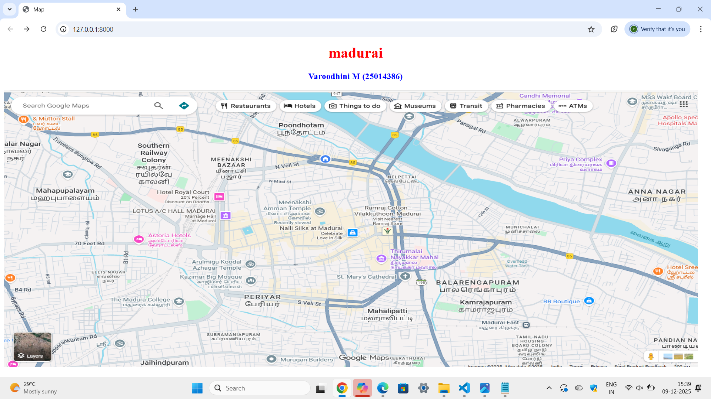
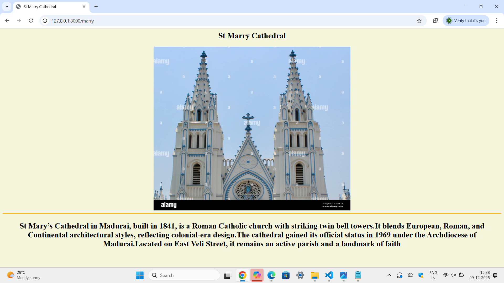
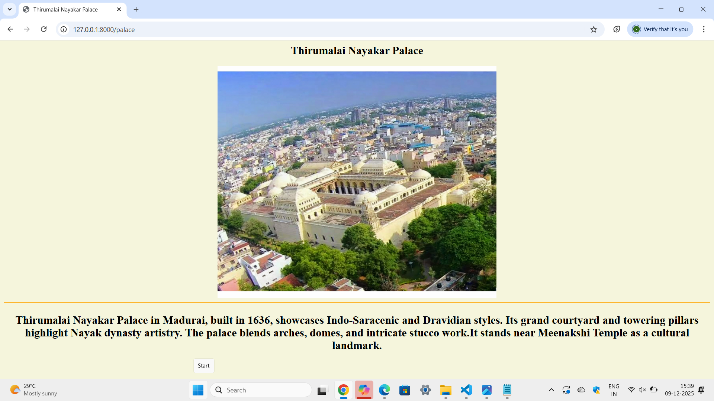
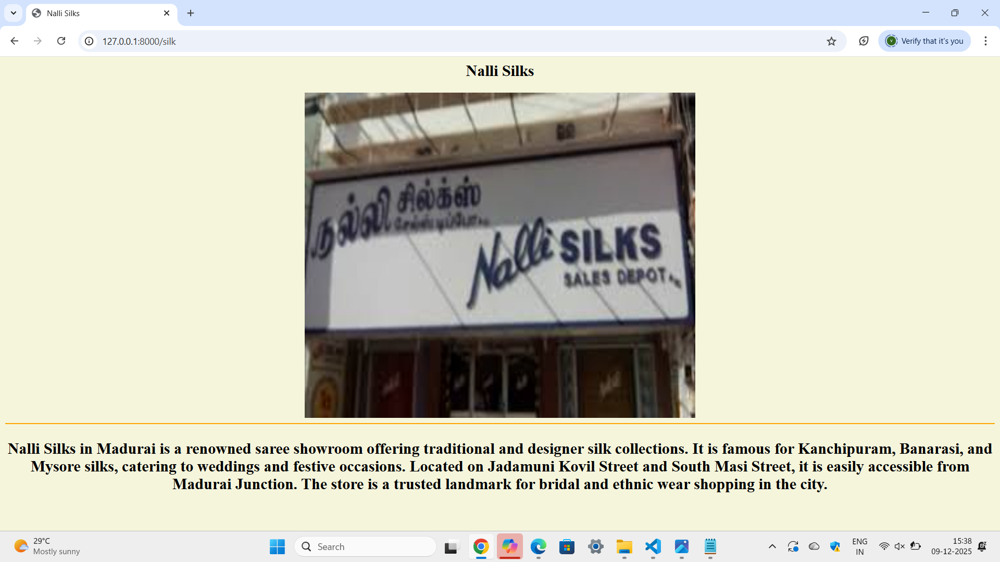
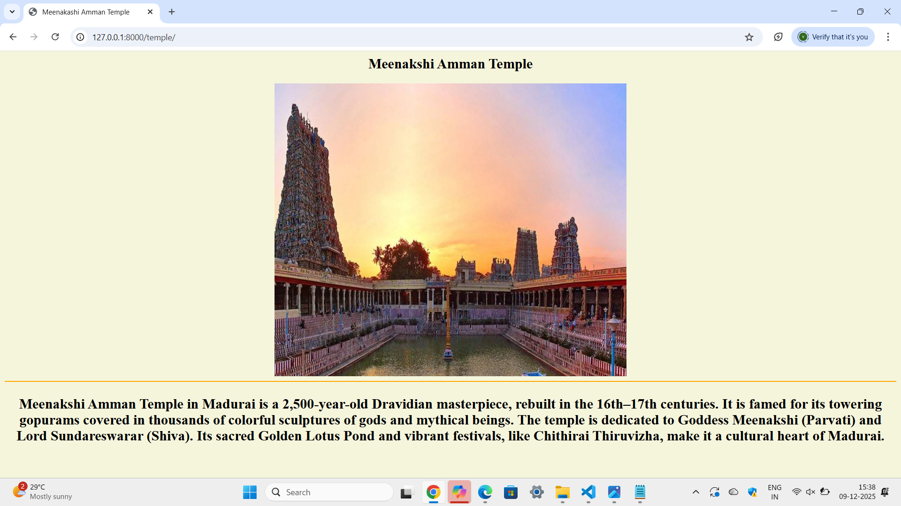

# Ex03 Places Around Me
# Date:25-11-2025
# AIM
To develop a website to display details about the places around my house.

# DESIGN STEPS
## STEP 1
Create a Django admin interface.

## STEP 2
Download your city map from Google.

## STEP 3
Using <map> tag name the map.

## STEP 4
Create clickable regions in the image using <area> tag.

## STEP 5
Write HTML programs for all the regions identified.

## STEP 6
Execute the programs and publish them.

# CODE
map.html
```

<html>
        <head>
            <title>Map</title>
        </head>
        <body>
            <h1 align="center">
                <font color="red"><b>madurai</b></font>
            </h1>
            <h3 align="center">
                <font color="blue"><b>Varoodhini M (25014386)</b></font>
            </h3>
            

            <map name="image-map">
                 <area shape="rect" coords="580,440,640,500" alt="Rectangle" href="" title="Thirumalai Nayakar palace">
                 <area shape="rect" coords="440,420,500,480" alt="Rectangle" href="" title="St Marry Cathedral"> 
                 <area shape="rect" coords="510,360,570,420" alt="Rectangle" href=""title="Meenakshi Amman Temple">
                 <area shape="rect" coords="520,500,580,560" alt="Rectangle" href="" title="Nalli Silks">
            </map>

        </body>
</html>
```

marry.html
```

<html>
        <head>
            <title>St Marry Cathedral</title>
        </head>
        <body bgcolor="beige" text="black">
            <center>
                <h2 >St Marry Cathedral</h2>
                
                <hr color="orange">
           <h2> <p>St Mary’s Cathedral in Madurai, built in 1841, is a Roman Catholic church with striking twin bell towers.It blends European, Roman, and Continental architectural styles, reflecting colonial-era design.The cathedral gained its official status in 1969 under the Archdiocese of Madurai.Located on East Veli Street, it remains an active parish and a landmark of faith</p></h2>
            </center>
        </body>
</html>
```

palace.html
```

<html>
        <head>
            <title>Thirumalai Nayakar Palace</title>
        </head>
        <body bgcolor="beige" text="black">
            <center>
                <h2>Thirumalai Nayakar Palace</h2>
                 
                  <hr color="orange">
            <h2> <p>Thirumalai Nayakar Palace in Madurai, built in 1636, showcases Indo-Saracenic and Dravidian styles.
                Its grand courtyard and towering pillars highlight Nayak dynasty artistry.
                The palace blends arches, domes, and intricate stucco work.It stands near Meenakshi Temple as a cultural landmark.</p></h2>
            </center>
        </body>
</html>
```

silk.html
```

<html>
        <head>
            <title>Nalli Silks</title>
        </head>
        <body bgcolor="beige" text="black">
            <center>
                <h2>Nalli Silks</h2>
                
                <hr color="orange">
            <h2> <p>Nalli Silks in Madurai is a renowned saree showroom offering traditional and designer silk collections.
                It is famous for Kanchipuram, Banarasi, and Mysore silks, catering to weddings and festive occasions.
                Located on Jadamuni Kovil Street and South Masi Street, it is easily accessible from Madurai Junction.
                The store is a trusted landmark for bridal and ethnic wear shopping in the city.</p></h2>
        </body>
</html>
```
temple.html
```

<html>
        <head>
            <title>Meenakashi Amman Temple</title>
        </head>
        <body bgcolor="beige" text="black">
            <center>
                <h2>Meenakshi Amman Temple</h2>
                
                 <hr color="orange">
            <h2><p>Meenakshi Amman Temple in Madurai is a 2,500-year-old Dravidian masterpiece, rebuilt in the 16th–17th centuries.
                It is famed for its towering gopurams covered in thousands of colorful sculptures of gods and mythical beings.
                The temple is dedicated to Goddess Meenakshi (Parvati) and Lord Sundareswarar (Shiva).
                Its sacred Golden Lotus Pond and vibrant festivals, like Chithirai Thiruvizha, make it a cultural heart of Madurai.</p></h2>
            </center>  
        </body>
</html>
```

urls.py
```
from django.contrib import admin
from django.urls import path
from myapp import views

urlpatterns = [
    path('admin/', admin.site.urls),
    path('',views.home,name='home'),
    path('marry',views.mar,name='marr'),
    path('palace',views.place,name='place'),
    path('silk',views.sil,name='sil'),
    path('temple/',views.temp,name='temp')
]
```

views.py
```
from django.shortcuts import render

def home(request):
    return render(request,'map.html')
def mar(request):
    return render(request,'marry.html')
def place(request):
    return render(request,'palace.html')
def sil(request):
    return render(request,'silk.html')
def temp(request):
    return render(request,'temple.html')

```

# OUTPUT






# RESULT
The program for implementing image maps using HTML is executed successfully.
